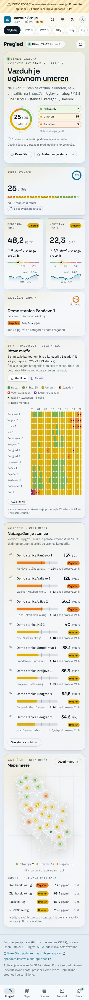
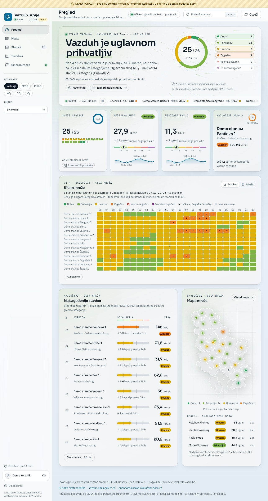
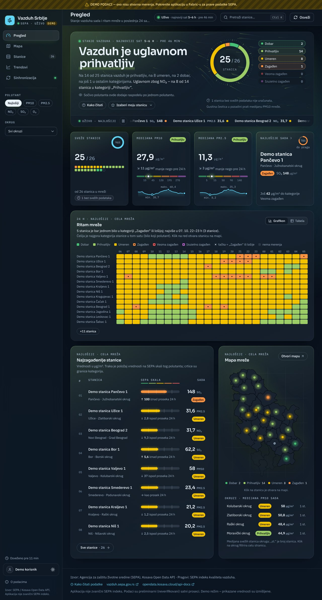

# Vazduh Srbije

**Microsoft Fabric App** (Fabric Apps, *preview*) koja prikazuje trenutni kvalitet vazduha u Srbiji iz
zvaničnog javnog izvora: državne mreže automatskog monitoringa **Agencije za zaštitu životne sredine
(SEPA)**, dostupne kroz **Kosava Open Data API**. Aplikacija je izgrađena na Rayfin SDK-u 1.36.2 i u
celini radi unutar Microsoft Fabric-a: frontend je statički sajt koji Fabric hostuje, podaci stoje u
SQL bazi u Fabric-u, a preuzimanje sa SEPA API-ja rade Fabric *user data functions* napisane u TypeScript-u.

**Za koga i za šta.** Za korisnike Fabric tenanta kojima je stavka podeljena, najčešće na telefonu. Aplikacija
odgovara na tri pitanja: *kakav je vazduh sada* (u mreži i na mojoj stanici), *gde je najgore i zbog kog
polutanta* i *da li je bolje ili gore nego ranije*. Svaki broj je definisan u
[docs/IZVOR-PODATAKA.md § 5](docs/IZVOR-PODATAKA.md#5-definicije-pokazatelja).

> **Pročitajte pre upotrebe**
>
> - **Fabric Apps je u preview fazi.** Administrator tenanta mora da uključi podešavanje
>   **Fabric Apps (preview)** u admin portalu pre nego što bilo ko može da napravi stavku.
> - **Deploy-ovana aplikacija koristi isključivo Fabric SSO** (Microsoft Entra ID). Prijava e-poštom i
>   lozinkom ne radi posle deploy-a; u `rayfin/rayfin.yml` je i isključena (`password.enabled: false`).
> - **Podaci su preliminarna (neverifikovana) merenja SEPA** – satne srednje vrednosti koje API vraća sa
>   oznakom `data_status: preliminary` i koje naknadno mogu biti revidirane.
> - **Aplikacija nije zvanični SEPA indeks kvaliteta vazduha.** Koristi SEPA satne pragove i nazive
>   kategorija, ali je prikaz i agregacija naša (vidi [docs/IZVOR-PODATAKA.md](docs/IZVOR-PODATAKA.md)).

## Snimci ekrana

Snimke generiše `npm run screenshots` iz **demo** build-a (`VITE_SERVICE_MODE=demo`), pa prikazuju
izmišljene demo stanice sa trakom „DEMO PODACI“ – ne stvarna merenja. Skup za dokumentaciju ima 12
JPEG snimaka cele strane (`docs/screenshots/<stranica>-<phone|desktop>-<light|dark>.jpg`): Pregled u
sve četiri varijante, a ostale stranice u tamnoj temi na desktopu i telefonu.

**Pregled** – stanje vazduha, KPI, ritam mreže 24 h, najzagađenije stanice, mapa i traka najnovijih vrednosti:

| Telefon (390×844) | Desktop (1280×900) |
| --- | --- |
|  |  |
|  |  |

Ostale stranice (tamna tema):

- **Mapa** ([desktop](docs/screenshots/mapa-desktop-dark.jpg), [telefon](docs/screenshots/mapa-phone-dark.jpg)) –
  mapa sa markerima po sočivu i detalj izabrane stanice (24 h i 30 dana).
- **Stanice** ([desktop](docs/screenshots/stanice-desktop-dark.jpg), [telefon](docs/screenshots/stanice-phone-dark.jpg)) –
  tabela (na telefonu kartice) sa pretragom, okruzima, SEPA skalom i promenom prema proseku 24 h.
- **Trendovi** ([desktop](docs/screenshots/trendovi-desktop-dark.jpg), [telefon](docs/screenshots/trendovi-phone-dark.jpg)) –
  trend mreže 30 dana, kalendar stanica i okruzi (sada prema proseku 24 h).
- **Sinhronizacija** ([desktop](docs/screenshots/sinhronizacija-desktop-dark.jpg), [telefon](docs/screenshots/sinhronizacija-phone-dark.jpg)) –
  svežina podataka, dnevnik poslova, „Kako rade podaci“ i izvor.

Za proveru pojedinih stranica u PNG formatu, npr.:
`node scripts/screenshots.mjs --views mapa --variants phone-light --format png --out /tmp/snimci`.
Opcija `--scenario empty|late|smog|beograd` snima demo scenario (`?demo=`, vidi
[Lokalni razvoj](#lokalni-razvoj)); datoteke tada nose i ime scenarija (`mapa-phone-dark-beograd.png`).
Scenario `beograd` pokazuje grupu stanica „Grad Beograd · 33“ na celoj mapi; snimak uvećanog okruga se
dobija adresom sa filterom (`#/?view=mapa&okrug=Grad%20Beograd`).

## Šta aplikacija prikazuje

Ljuska sa pet stranica na jednoj ruti (`/`, zahteva prijavu), prilagođena telefonu od 360 px do
desktopa. Stranica se bira parametrom `?view=` (`pregled` | `mapa` | `stanice` | `trendovi` |
`sinhronizacija`; demo build: `#/?view=mapa`), pa radi i na Fabric statičkom hostingu bez SPA
fallback-a. URL nosi i sočivo (`?lens=`), okrug (`?okrug=`), izabranu stanicu (`?station=`) i, na
Stanicama, pretragu, filter i redosled (`?q=`, `?grupa=`, `?sort=`, `?neaktivne=`), pa prikaz preživljava
ponovno učitavanje i „Nazad“. **Link sa prikazom radi samo na samostalnom URL-u aplikacije** (App URL,
odnosno hosting URL iz izlaza `rayfin up`). U Fabric portalu aplikacija radi u iframe-u bez sopstvene
adrese, pa se tamo prikaz ne može podeliti linkom. Link sa nepostojećom stanicom, okrugom ili polutantom
prikazuje poruku o tome, a ne tiho neku drugu stanicu.

- **Ljuska** – na desktopu (≥ 1024 px) bočna traka sa stranicama, na telefonu gornja traka i donja
  navigacija sa pet stranica. Svuda: sočivo **POLUTANT** (Najlošiji · PM10 · PM2.5 · NO₂ · SO₂ · O₃)
  koje boji markere, tabele i toplotne mape po kategoriji tog polutanta; filter **OKRUG** (bočna traka
  ili list na telefonu); paleta komandi (Ctrl/⌘K ili „/“) za pretragu stanica, stranica i filtera;
  svetla/tamna tema; „Osveženo pre …“ iz poslednje uspešne sinhronizacije i dugme „Osveži“; čip
  najnovijeg sata („Uživo · 16–17 h · pre 28 min“ – starost se računa od kraja intervala – samo dok je
  sat zaista nov, inače „Poslednji sat …“).
- **Pregled** – kartica **Moja stanica** (kad je izabrana); heroj sa rečenicom o stanju vazduha (uvek svi
  polutanti; kad je bar 40 % stanica u lošijim kategorijama od najčešće, naslov ima dva stanja: „Vazduh
  je umeren do zagađen“), rečenicom „zbog kog polutanta“, segmentiranim prstenom kategorija, dugmetom
  „Kako čitati“ i česticama Košave čija gustina prati medijanu PM10, ispod njega traka najnovijih
  vrednosti (ne na telefonu; za tastaturu je jedno Tab-mesto, po stanicama se ide strelicama); KPI
  pločice (sveže stanice, medijane PM10/PM2.5 sa 24 h linijom i promenom, najlošija stanica); „Ritam
  mreže · 24 h“ (stanice × sati); najzagađenije stanice sa trakom prema SEPA pragovima; mapa mreže sa
  okruzima (uz broj stanica u medijani).
- **Mapa** – ručno crtan SVG Srbije sa granicama okruga; markeri u boji kategorije kroz sočivo; stanice
  bez koordinata stoje u centru svog okruga sa oznakom „približna lokacija“. Markeri koji bi se
  preklopili (npr. dve stanice istog grada) razmiču se na ekranu tek koliko tačka zahteva (12 px + 2 px razmaka);
  legenda tada kaže „Preklopljene stanice su razmaknute (do N km)“, a tooltip pomerene stanice koliko
  je pomerena. Gust okrug (bar tri stanice koje bi se morale razmaći više od 5 km – Beograd sa 33 stanice)
  je na celoj mapi **grupa stanica**: disk sa brojem i prstenom udela kategorija; dodir na grupu
  **uvećava mapu na taj okrug** (isto kao filter okruga), gde su tačke na pravim mestima (pomak ≤ 1–2 km),
  mreža ide na pola stepena, a razmernik na 20 km; „Ukloni filter“ vraća celu mrežu. Pored mape detalj
  izabrane stanice (bez `?station=` to je „Najlošije sada“ sa Pregleda, i ostaje izabrana posle
  osvežavanja): trenutne vrednosti po polutantu, grafikon poslednja 24 sata i dnevni maksimumi za 30 dana
  sa pragovima; svaki grafikon ima i tabelarni prikaz. Na telefonu, dok je detalj ispod ekrana, iznad
  donje navigacije stoji traka izabrane stanice sa dugmetom „Detalji“.
- **Stanice** – sve aktivne stanice (na telefonu kartice: bez filtera prvih 20 i dugme „+N stanica“) sa
  pretragom po nazivu i opštini, okruzima, filterom kategorije, sortiranjem, istaknutom kolonom sočiva i
  promenom prema proseku 24 h; neaktivne (ugašene) stanice samo na zahtev; klik otvara stanicu na Mapi,
  a „Nazad“ vraća listu kakva je bila.
- **Trendovi** – tri pločice (tipičan dnevni nivo PM10 ili polutanta sočiva, udeo stanica-dana
  „Zagađen“ ili lošije u poslednjih 15 dana prema prethodnih 15, najlošiji dan), udeo stanica po
  kategoriji za svaki od poslednjih 30 dana, kalendar stanica (stanice × dani) i okruzi (medijana sada
  prema proseku 24 h). Dan stanice sa manje od 18 h merenja je šrafiran i ne ulazi u brojeve; dan koji
  uopšte nije učitan u bazu piše se kao „nije učitan“, ne kao „nema merenja“.
- **Sinhronizacija** – svežina podataka („Od sinhronizacije“, prag 65 min) i stanja kao „SEPA kasni“;
  dugme „Osveži sada“; **Istorija u bazi · 27/30 dana** (traka 30 prošlih dana: potpun, delimičan,
  nije učitan, istekao) sa dugmetom „Dopuni nedostajuće dane“ i napretkom; dnevnik poslednjih poslova
  (vremenska linija i tabela, trake trajanja u razmeri najdužeg prikazanog posla, oznake „Delimično“ i
  „Neispravan zapis“), „Kako rade podaci“ i izvor („O podacima“). Očekivano trajanje („obično oko
  12 s · limit 240 s“) je prosek izmerenih poslova iz dnevnika; bez merenja piše „ispod minuta“.
- **Prvi start** – posle deploy-a baza je prazna; ekran objašnjava šta treba uraditi i nudi
  „Preuzmi podatke sa SEPA“ i „Učitaj istoriju (30 dana)“.
- **Kako čitati** – dijalog sa SEPA pragovima i savetima, pravilom najlošijeg polutanta, pravilima
  svežine i napomenom o preliminarnim podacima (dugme u heroju Pregleda i link u podnožju).
- **Moja stanica** – izbor u heroju Pregleda ili u detalju stanice („Postavi kao moju stanicu“); pamti
  se samo u ovom pregledaču, nije u bazi i ne vidi je niko drugi.
- **Podnožje** – izvor i atribucija, linkovi na <https://vazduh.sepa.gov.rs/> i
  <https://opendata.kosava.cloud/api-docs>, napomena „Aplikacija nije zvanični SEPA indeks“ i da su
  podaci preliminarni, „Kako čitati podatke“.

Korisnički interfejs je na srpskom (latinica, `sr-Latn-RS`), vremena su u zoni `Europe/Belgrade`.

## Arhitektura

Jedna Fabric stavka i njeni podređeni servisi; sve se postavlja jednom komandom `npx rayfin up`.

```text
┌──────────────────────────────────────────────────────────────────────────────────┐
│  Microsoft Fabric – radni prostor sa Fabric kapacitetom                          │
│                                                                                  │
│  Fabric App „vazduh-srbije“ (Rayfin stavka)                                      │
│  ├─ Static Content ........ dist/ (React 19 + Vite + Tailwind v4, sr-Latn)        │
│  ├─ Authentication ........ Fabric SSO (Microsoft Entra ID), bez lozinki          │
│  ├─ SQL database in Fabric  Station · StationSnapshot · DailyStat · SyncRun      │
│  │     └─ GraphQL data API  ◄── RayfinClient<VazduhSchema, AppFunctionsSchema>   │
│  └─ User data functions ... syncAirQuality({ hoursBack })  backfillDay({ day })  │
│          │ fetch (HTTPS, bez API ključa)                                         │
└──────────┼───────────────────────────────────────────────────────────────────────┘
           ▼
   SEPA · Kosava Open Data API   https://opendata.kosava.cloud/api/v1
   GET /stations?active=true     GET /observations?station_id=…&from=…&to=…
   (satne srednje vrednosti, čuva se poslednjih 30 dana, data_status = preliminary)
```

Tok u browseru:

```text
Browser ──Fabric SSO──► sesija
Browser ──GraphQL (čitanje)──► SQL baza aplikacije           (RayfinClient.data.<Entitet>)
Browser ──client.functions.syncAirQuality.invoke({ hoursBack: 72 })──► funkcija
                                                            └─► Kosava API ─► upsert redova
```

SQL baza aplikacije je dugoročno skladište: API čuva samo 30 dana, a tabela `DailyStat` raste
svakom sinhronizacijom i čuva dnevnu statistiku trajno. Detalji su u
[docs/ARHITEKTURA.md](docs/ARHITEKTURA.md).

### Struktura repozitorijuma

```text
rayfin/rayfin.yml                 Fabric servisi (auth, data/mssql, staticHosting, functions)
rayfin/data/*.ts, schema.ts       Entiteti (dekoratori @entity, @authenticated …) → SQL šema + GraphQL
rayfin/functions/src/
  function_app.ts                 Registracija funkcija (udf.func)
  sync.ts                         Orkestracija sinhronizacije i istorije
  kosavaClient.ts                 HTTP klijent za Kosava API (timeout, retry, paralelnost)
  ids.ts                          Deterministički UUID v5 identifikatori
  shared/*.ts                     Logika zajednička za server i browser (@shared/*): aqi, time,
                                  kosava parseri, aggregate, contracts, syncNotes (tekstovi upozorenja)
  types.ts                        GENERISANO – AppFunctionsSchema (npm run typegen)
src/                              Frontend (React), servisi za auth i podatke, demo režim
tests/                            Vitest testovi (bez mreže)
scripts/typegen.mjs               Regeneriše types.ts i runtimemetadata.json
scripts/screenshots.mjs           Snimci ekrana demo build-a (Playwright)
scripts/e2e.mjs                   E2E provere demo build-a u Chromium-u (Playwright, bez mreže)
docs/                             Dokumentacija (ovaj README, ARHITEKTURA, IZVOR-PODATAKA)
```

## Preduslovi

1. **Microsoft Fabric tenant** u kome je administrator tenanta uključio **Fabric Apps (preview)**:
   Fabric admin portal → **Tenant settings** → **Fabric Apps (preview)** → **Enabled** (cela
   organizacija ili bezbednosne grupe) → **Apply**. Promena može da se propagira nekoliko minuta.
   Fabric Apps nije dostupan u svim regionima – proverite listu podržanih regiona u Fabric dokumentaciji.
2. **Radni prostor sa dodeljenim Fabric kapacitetom** (probni ili plaćeni). Servisi aplikacije troše
   jedinice kapaciteta (CU) tog radnog prostora – vidi [Ograničenja](#ograničenja-i-troškovi).
3. **Dozvole** – ko deploy-uje treba da ima bar **Edit** na stavci (contributor/admin u radnom
   prostoru); ko koristi aplikaciju treba **Run and interact** (Read and execute) na stavci.
   Uloge radnog prostora ne zamenjuju dozvole na stavci.
4. **Node.js 20 ili noviji** i **npm** (CI koristi Node 22). Docker nije potreban – podrazumevani
   Rayfin provider je Fabric.
5. **Skladište lozinki operativnog sistema** (keychain) za keš tokena. Na Linux-u, u dev kontejnerima i
   Codespaces-u bez keychain-a koristite `npx rayfin login --encryption-fallback-enabled`
   (token se čuva u običnom tekstu – samo za razvoj).

## Deploy u Fabric, korak po korak

Opšti opis komandi. Konkretan postupak za radni prostor ovog projekta, sa proverom posle deploy-a i
vraćanjem na prethodnu verziju, je u odeljku [Deploy u FabricPlayground-Luka](#deploy-u-fabricplayground-luka).

Iz korena projekta:

```bash
npm install
npm --prefix rayfin/functions install
npx rayfin login
npx rayfin up --workspace "<ime radnog prostora>"
```

- `npx rayfin login` otvara browser za interaktivnu prijavu Microsoft nalogom; tokeni se čuvaju u
  keychain-u pod `~/.rayfin/`. Status: `npx rayfin login status`.
- `npx rayfin up` redom: (1) kreira Rayfin stavku u radnom prostoru ili ponovo koristi postojeću,
  (2) preuzima *publishable key*, (3) primenjuje podešavanja iz `rayfin.yml` (auth, servisi),
  (4) primenjuje SQL šemu generisanu iz dekoratora u `rayfin/data`, (5) gradi i postavlja statički
  sadržaj (`npm run build:fabric` → `dist/`) i funkcije (`rayfin/functions`, `npm run build`),
  (6) upisuje detalje deploy-a u `rayfin/.deployments.json` i `rayfin/.env` (oba su u `.gitignore`).
  Na kraju ispisuje **hosting URL**, **link na Fabric portal** i ID deploy-a.
- Ako radni prostor nema kapacitet, interaktivni `rayfin up` traži potvrdu dodele kapaciteta;
  `--yes` je automatski potvrđuje, a `--capacity-id <id>` bira konkretan kapacitet (ne kombinuje se sa
  `--workspace`).
- Provera stanja: `npx rayfin up status`. Pregled bez promena: `npx rayfin up --dry-run`.

### Prvi start u Fabric portalu

1. Otvorite stavku u Fabric portalu (link iz izlaza komande) ili **App URL** stavke.
2. Prijavite se Fabric SSO-om (dugme „Prijavite se Microsoft nalogom“; iz portala se sesija preuzima
   automatski).
3. Baza je prazna – pritisnite **„Preuzmi podatke sa SEPA“**. Funkcija `syncAirQuality` preuzima
   poslednja 72 sata (od lokalne ponoći) za sve aktivne stanice. Trajanje nije obećano: izmereno
   8. 10. 2026. na prvoj verziji (prozor 36 h) bilo je ~12 s za 87 stanica, 18.382 merenja i 1.303 reda;
   prozor od 72 h upisuje ≈ 1,5× više redova dnevne statistike – proveriti posle sledeće sinhronizacije
   u dnevniku. Napredak se vidi na ekranu prvog starta, a kasnije na stranici **Sinhronizacija** i u
   obaveštenju u uglu.
4. Na stranici **Sinhronizacija** pritisnite **„Dopuni nedostajuće dane (N)“** (broj je broj dana koji
   nedostaju; dok je baza još prazna, isto dugme glasi „Učitaj istoriju (30 dana)“). Frontend proverava
   koji od poslednjih 30 dana u bazi nisu potpuni i za njih poziva `backfillDay` **dan po dan, od
   najstarijeg** (izvor najstarije dane prvi briše). Petlja radi u kartici pregledača: držite ekran
   uključen. Trajanje po danu aplikacija procenjuje iz izmerenih poslova („oko 40 s po danu, ukupno
   oko 20 min za 30 dana“); bez merenja piše „obično ispod minuta po danu“. Može da se zaustavi; ponovno
   „Dopuni nedostajuće dane“ preskače potpune dane i nastavlja od prvog koji još nedostaje. Uradite ovo
   odmah posle deploy-a: API čuva samo 30 dana, a najstariji dan prozora koji je već delimičan je
   „istekao“ – izvor ga briše, pa se ne dopunjava.

### Kasniji deploy-i

| Komanda | Šta ažurira |
| --- | --- |
| `npx rayfin up` | Sve: podešavanja, bazu, statički sadržaj i funkcije (isti deploy, ne nova stavka). |
| `npx rayfin up db apply` | Samo šemu baze (posle izmena u `rayfin/data`); `--force` dozvoljava destruktivne izmene. |
| `npx rayfin up staticapp deploy` | Samo statički sadržaj (`--skip-build` koristi postojeći `dist/`). |
| `npx rayfin up functions deploy` | Samo funkcije (`--skip-build` koristi postojeći build). |
| `npx rayfin up status` | Stanje deploy-a (`--json` za mašinski čitljiv izlaz). |
| `npx rayfin logout` | Briše keširane kredencijale. |

Napomena: `rayfin/.deployments.json` i `rayfin/.env` nisu u git-u, pa svaka mašina pamti svoj deploy.
Pri deploy-u sa druge mašine `rayfin up` traži potvrdu ponovne upotrebe istoimene stavke – odgovorite
potvrdno (`--yes` je prihvata automatski); vidi [Drugi i sledeći deploy](#drugi-i-sledeći-deploy).

## Deploy u FabricPlayground-Luka

U tenantu je Fabric Apps (preview) uključen, a radni prostor **FabricPlayground-Luka** (probni
kapacitet, West Europe) pored starije Fabric App stavke **Test-app** od prvog deploy-a ima i stavku
**`vazduh-srbije`** (id iz `rayfin/rayfin.yml`) sa pravim podacima (stanje 8. 10. 2026.: 87 aktivnih
stanica). Svaki sledeći `rayfin up` **ponovo koristi tu stavku**; Test-app ostaje netaknut. Ne koristite
`--item-name Test-app` (napravljen je iz drugog šablona, pa bi se šeme sukobile).

**Potrebno:** računar sa Node.js 20+ ili GitHub Codespaces (Rayfin CLI radi u terminalu, pa deploy sa
iPhone-a nije moguć) i nalog sa bar **Edit** pravom u radnom prostoru. U Codespaces-u, dev kontejneru i
na Linux-u bez keychain-a prijava ide sa `--encryption-fallback-enabled`: token se tada čuva kao običan
tekst, pa posle rada pokrenite `npx rayfin logout`.

```bash
npm ci
npm --prefix rayfin/functions ci
npx rayfin login                    # Codespaces: npx rayfin login --encryption-fallback-enabled
npx rayfin up -n --workspace "FabricPlayground-Luka"
npx rayfin up --workspace "FabricPlayground-Luka"
```

1. **Probni prolaz (`-n`, dry run).** Proverava lokalne ulaze, prijavu i radni prostor, a ne gradi, ne
   pravi stavku i ne menja fajlove. U izlazu proverite da je radni prostor FabricPlayground-Luka i da se
   **ponovo koristi postojeća stavka `vazduh-srbije`** – to je očekivana poruka na svakom deploy-u posle
   prvog. Stanite samo ako bi se **napravila nova (druga) stavka** `vazduh-srbije`: tada CLI nije našao
   postojeću (pogrešan radni prostor ili nalog bez prava na stavku), a druga stavka bi imala praznu bazu.
2. **Pravi deploy (bez `-n`).** Na kraju ispisuje hosting URL (App URL), link na portal i ID deploy-a;
   zapišite ih u [dnevnik deploy-a](#dnevnik-deploy-a) uz git oznaku (vidi dole).
3. **Prvi start (samo na praznoj bazi):** kao u odeljku [Prvi start u Fabric portalu](#prvi-start-u-fabric-portalu) –
   „Preuzmi podatke sa SEPA“, pa odmah na stranici Sinhronizacija „Dopuni nedostajuće dane (N)“ (na
   praznoj bazi dugme glasi „Učitaj istoriju (30 dana)“). Posle kasnijih deploy-a podaci ostaju u bazi:
   dovoljno je otvoriti aplikaciju i pogledati dnevnik na stranici Sinhronizacija.

### Drugi i sledeći deploy

- Sa iste mašine (istog Codespace-a) `rayfin up` čita `rayfin/.deployments.json` i bez pitanja ažurira
  postojeću stavku. Sa nove mašine tog fajla nema, pa CLI pita da li da ponovo koristi istoimenu stavku
  `vazduh-srbije` u radnom prostoru – odgovorite **da**. Odgovor „ne“ ili pogrešan radni prostor pravi
  drugu stavku sa praznom bazom.
- Pre deploy-a prođite provere iz [Provera kvaliteta i CI](#provera-kvaliteta-i-ci) (`npm run typegen`
  ne sme da menja `types.ts`), a posle deploy-a [proveru posle deploy-a](#provera-posle-deploy-a). Šema
  baze se u ovoj verziji ne menja, pa `rayfin up` ne traži `--force`.
- Izmerene vrednosti u ovom README-ju (~12 s, 1.303 reda) važe za prvu verziju sa prozorom od 36 h;
  posle prvog deploy-a verzije sa 72 h proverite trajanje u dnevniku i ispravite ih ovde.

### Dnevnik deploy-a

Jedan red po deploy-u: datum, git oznaka postavljenog commit-a i ishod. Koji je commit trenutno u Fabric-u
ne može da se pročita iz portala – zato oznaka (vidi
[Oznaka po deploy-u](#oznaka-po-deploy-u-i-vraćanje-na-prethodnu-verziju)).

| Datum | Oznaka | Ishod |
| --- | --- | --- |
| 8. 10. 2026. (merenja; tačan dan i commit deploy-a nisu zabeleženi) | nije postavljena – vlasnik treba da označi commit koji je postavio (`git tag -a deploy-2026-10-08 <commit>`) | Prvi deploy: stavka `vazduh-srbije` napravljena, Fabric SSO radi. Prva sinhronizacija (prozor 36 h, prva verzija): 87 stanica, 18.382 merenja, 1.303 reda, ~12 s – proveriti posle sledeće sinhronizacije. |

### Provera posle deploy-a

- [ ] Aplikacija se otvara iz portala (prijava se preuzima sama) i na App URL-u (dugme za prijavu).
- [ ] Prva sinhronizacija u dnevniku (stranica Sinhronizacija) je „Uspešno“ ili „Delimično“ sa brojem
      stanica; zapišite trajanje u [dnevnik deploy-a](#dnevnik-deploy-a) (8. 10. 2026.: ~12 s za 36 h;
      host prekida funkciju na 250 s, preuzimanje sa izvora staje najkasnije posle 180 s, vidi
      [Kako teku podaci](#kako-teku-podaci-i-koliko-traje-sinhronizacija)).
- [ ] Posle „Dopuni nedostajuće dane“ piše „Istorija u bazi · 30/30 dana“ (ili 29/30 uz „istekao“), a
      dugme „Istorija je potpuna“. Najstariji dan prozora koji je već delimičan izvor briše, pa je
      označen „istekao“ i ne broji se ni kao potpun ni kao nedostajući.
- [ ] Drugi korisnik tenanta, kome je stavka podeljena sa **Run and interact**, otvara aplikaciju i vidi
      iste podatke.
- [ ] Na App URL-u: „Odjava“, pa ponovno učitavanje strane na `/auth`. Ako hosting vrati 404 (statički
      hosting nema SPA fallback), otvorite koren URL-a i zabeležite problem: rešenje je mala izmena
      build-a (kopija `index.html` u `dist/auth/`) ili prijava kroz `?view=`.
- [ ] Za jednu stanicu uporedite sat sa <https://vazduh.sepa.gov.rs/>. Aplikacija prikazuje interval
      („16–17 h“) čiji je početak `time_start_utc`. Ako SEPA isti prosek označava krajem sata („17 h“),
      aplikacija ne kasni.
- [ ] Link sa prikazom (npr. `?view=mapa&station=…`) radi na App URL-u. U portalu se to ne očekuje.
- [ ] Posle prvog dana pogledajte potrošnju u *Microsoft Fabric Capacity Metrics*.

### Oznaka po deploy-u i vraćanje na prethodnu verziju

Za svaki deploy označite commit koji postavljate, npr.
`git tag -a deploy-2026-10-08 -m "Deploy u FabricPlayground-Luka"` i `git push origin deploy-2026-10-08`
(sve izmene moraju biti u commit-u), i upišite red u [dnevnik deploy-a](#dnevnik-deploy-a). Za prvi
deploy oznaka još ne postoji (`git tag -l` je prazan): vlasnik treba da je postavi na commit koji je
postavio, jer se iz portala ne vidi koji je commit u Fabric-u. Vraćanje frontenda i funkcija na raniju
oznaku:

```bash
git checkout deploy-2026-10-08
npm ci && npm --prefix rayfin/functions ci
npx rayfin up staticapp deploy      # frontend te verzije
npx rayfin up functions deploy      # funkcije te verzije
git checkout main
```

- **Šema baze ide samo napred.** Za vraćanje ne koristite pun `npx rayfin up` ni `npx rayfin up db apply`
  sa stare oznake: CLI blokira destruktivne izmene šeme, a `--force` briše podatke. Stariji kod radi nad
  novijom šemom dok god su izmene bile samo dodate kolone ili entiteti. Ova verzija ne menja šemu.
- Komande čitaju `rayfin/.deployments.json` i `rayfin/.env`, koji nisu u git-u. Vraćanje radite sa iste
  mašine (istog Codespace-a) sa koje je rađen deploy, ili sačuvajte kopiju ta dva fajla.
- Probni kapacitet ističe: vidi [Ograničenja](#ograničenja-i-troškovi) pre nego što istekne.

## Lokalni razvoj

| Režim | Komanda | Šta radi |
| --- | --- | --- |
| Rayfin (pravi backend) | `npm run dev` | `rayfin dev`: koristi Fabric backend (napravi AppBackend ako ne postoji), primenjuje podešavanja i šemu, pokreće Vite i lokalni host funkcija. Potrebna je prethodna prijava `npx rayfin login`. Frontend: <http://localhost:5173> (ovaj origin je u `allowedRedirectUris`). |
| Demo (bez backenda) | `npm run dev:demo` | Vite na <http://localhost:5174> sa `VITE_SERVICE_MODE=demo`: determinističke izmišljene stanice („Demo stanica …“, šifre `DEMO-…`), svaki ekran nosi traku **„DEMO PODACI — ovo nisu stvarna merenja…“**. Ništa se ne šalje na mrežu. Scenariji parametrom `?demo=` (pre ili posle `#`, npr. `#/?demo=smog`): `empty` (prazna baza, prvi ekran), `late` (SEPA kasni 4 h), `smog` (izmišljena epizoda smoga: medijana PM10 ≈ 300 µg/m³, najjača izmaglica i čestice), `beograd` (33 izmišljene beogradske stanice – gust centar i prsten do ~14 km: na celoj mapi grupa „Grad Beograd · 33“, dodir je otvara kao uvećan okrug). Traka tada nosi i napomenu o scenariju (`src/services/demoScenario.ts`). |
| Samo frontend | `npm run dev:frontend` | Vite bez `rayfin dev`, koristi vrednosti iz `.env.local` (generiše ih `rayfin env --framework vite`). |

U `rayfin` režimu aplikacija **nikad** ne prikazuje demo podatke, ni kao zamenu pri grešci. Lokalna
prijava u razvoju ide preko tokena iz `rayfin login` (`rayfinLocalDev({ autoLogin: true })` u
`vite.config.ts`); u produkcionom build-u taj kod ne postoji.

### Skripte (`package.json`)

| Skripta | Komanda | Namena |
| --- | --- | --- |
| `dev` | `rayfin dev` | Lokalni razvoj uz Fabric backend. |
| `dev:frontend` | `vite` | Samo Vite dev server. |
| `dev:demo` | `VITE_SERVICE_MODE=demo vite --port 5174` | Demo režim bez backenda. |
| `build` | `tsc -b && vite build` | Produkcioni build; `prebuild` pre toga pokreće `rayfin env --framework vite`. |
| `build:fabric` | `tsc -b && vite build` | Build koji `rayfin up` poziva za statički sadržaj (`rayfin.yml`); `prebuild:fabric` pre toga osvežava `.env.local`. |
| `build:demo` | `VITE_SERVICE_MODE=demo vite build --outDir dist-demo` | Demo build (koristi ga CI i `screenshots`). |
| `preview` | `vite preview` | Pregled produkcionog build-a. |
| `typecheck` | `tsc -b` | Provera tipova frontenda i `rayfin/data`. |
| `lint` | `eslint .` | ESLint (za `rayfin/**` i tipizirano pravilo `no-deprecated`). |
| `test` | `vitest run` | Jedinični testovi (`tests/**`, `src/**`); bez mreže. |
| `typegen` | `node scripts/typegen.mjs` | Regeneriše `rayfin/functions/src/types.ts` i `runtimemetadata.json`; idempotentno. |
| `functions:build` | `npm --prefix rayfin/functions run build` | TypeScript build funkcija. |
| `rayfin:db` | `rayfin up db apply` | Primena šeme baze na deploy-ovanu stavku. |
| `screenshots` | `node scripts/screenshots.mjs` | Demo build + Playwright snimci (12 JPEG-ova za dokumentaciju) u `docs/screenshots/`; opcije `--views`, `--variants` (sve kombinacije), `--scenario empty\|late\|smog\|beograd` (demo scenario; datoteke `<view>-<variant>-<scenario>`), `--format jpeg\|png`, `--out`, `--no-build`. |
| `e2e` | `node scripts/e2e.mjs dist-demo dist-demo/e2e` | E2E provere demo build-a u Chromium-u (Playwright, bez mreže): navigacija, paleta, sočivo, okrug, tema, ponovno učitavanje, prelivanje na 390 px, smanjeno kretanje, Stanice posle „Nazad“, neispravan link, Moja stanica, „Kako čitati“, pokrivenost istorije, `?demo=late`, traka izabrane stanice iznad donje navigacije, kartice „+N stanica“, naslov heroja sa dva stanja, KPI brojevi bez odbrojavanja, traka „Uživo“ kao jedno Tab-mesto, `?demo=beograd` (grupa „Grad Beograd · 33“, dodir/Enter je otvara kao uvećan okrug sa 33 tačkama, mrežom na 0,5° i razmernikom 20 km, „Ukloni filter“ vraća grupu, kompaktna mapa Pregleda, telefon 390×664). Ispisuje OK/FAIL po proveri i „N/M provera prošlo“; izlazni kod 1 ako je bar jedna pala. Prethodno `npm run build:demo`; opšti oblik `node scripts/e2e.mjs <distDir> <outDir>` (snimci provera u `<outDir>`); Playwright/Chromium kao kod `screenshots` (`PLAYWRIGHT_PATH`, `CHROME_PATH`). |

## Kako teku podaci i koliko traje sinhronizacija

**`syncAirQuality({ hoursBack })`** (UI šalje 72 – `SYNC_HOURS_BACK` u `src/hooks/useSync.ts`; funkcija
ograničava na 3–168, podrazumevano 72 – `DEFAULT_HOURS_BACK` u `sync.ts`; menjaju se zajedno. 72 h, a ne
36, da se rupa preko vikenda – petak 18 h → ponedeljak 8 h = 62 h – sama zatvori i petak ostane potpun dan):

1. ako druga sinhronizacija trenutnog stanja upravo radi (red `SyncRun` vrste `sync`, `running`, mlađi
   od 5 min, ne iz budućnosti), vraća `ok: false` sa „Sinhronizacija je već u toku …“ i ne upisuje ništa;
   ako ta provera ne uspe, sinhronizacija ipak ide (paralelni poslovi su idempotentni);
2. upisuje red `SyncRun` sa statusom `running`;
3. `GET /stations?active=true` – lista aktivnih stanica; stanice koje su u bazi aktivne a API ih više
   ne vraća dobijaju `active = false`;
4. `GET /observations` za **svaku stanicu** u prozoru od **lokalne ponoći** dana u koji pada
   `sada − hoursBack` do `sada` (najviše `hoursBack + 24 h`), najviše 6 zahteva
   paralelno, 20 s po zahtevu, do 2 ponovna pokušaja za mrežne greške, HTTP 429 i 5xx; stanica koja ne
   uspe završava kao upozorenje `Stanica N: …`, ne kao greška cele sinhronizacije. **Vremenski rok:**
   posle 120 s od početka ne počinje preuzimanje nijedne nove stanice, a zahtevi koji još traju
   prekidaju se na 180 s (i vreme čekanja i pauze između pokušaja se skraćuju do roka). Ostatak do
   limita hosta (250 s) ostaje za upise;
5. iz satnih vrednosti pravi **snimak** svake stanice (`StationSnapshot`: najnovija vrednost svakog
   polutanta ne starija od 3 h od najnovijeg sata stanice, najgora SEPA kategorija, dominantni polutant,
   serija poslednja 24 sata) i upisuje stanice (sa `Station.lastObservationAt`) i snimke; stanica bez
   merenja u prozoru zadržava stari snimak;
6. računa **dnevnu statistiku** (`DailyStat`: prosek/maks/min, sat maksimuma, broj sati, kategorija
   maksimuma) za sve lokalne dane koje prozor pokriva – potpunu za svaki dan osim današnjeg, koji se
   dopunjava svakom sledećom sinhronizacijom. Prošli dan se **ne prepisuje** redom sa manje sati od
   onoga u bazi (na rubu od 30 dana izvor vraća samo deo dana);
7. zatvara `SyncRun` kao `ok` ili `error` (do 5 upozorenja u `message`, skraćeno na 900 znakova).
   Redosled upozorenja: „N stanica preskočeno – vremenski limit“, pa „N redova nije upisano u bazu“
   (vidi dole), pa `Stanica N: …` – zbirna upozorenja su prva da prežive skraćivanje. Posao u kome bar
   jedna stanica nema merenja (greška izvora ili rok) ili bar jedan red nije upisan je i dalje `ok`, a
   frontend ga prikazuje kao **„Delimično“** („Osveženo delimično: X od Y stanica“); te stanice
   zadržavaju ranije podatke.

Upisi idu kroz GraphQL klijent funkcije, najviše 8 paralelno; postojanje redova se proverava jednim
upitom po paketu id-jeva, pa se zove `create` ili `update` (klijentov `upsert` bi za svaki red slao dva
zahteva). **Ponovni pokušaj upisa:** upis koji padne na prolaznoj grešci (HTTP 429, 5xx, prekid mreže)
ponavlja se jednom posle 500 ms; ako padne i drugi put, red se preskače, a posao se zatvara kao `ok` sa
upozorenjem „N redova nije upisano u bazu“ (frontend: „Delimično“, obaveštenje „Osveženo delimično:
3 reda nisu upisana u bazu“) – ti redovi zadržavaju ranije vrednosti do sledeće sinhronizacije, koja ih
piše ponovo. Ako baza nije primila nijedan red (ili većinu), posao je `error` („Baza nije prihvatila
upise: …“), ne „Delimično“ – ispad baze se ne prikazuje kao sveža sinhronizacija. Ostale greške upisa
(odbijen ulaz, 400/409, programska greška u kodu) i dalje obaraju posao u `error`. Za mrežu od
87 stanica jedna sinhronizacija znači 88 HTTP poziva ka API-ju i oko 1.500–1.950 GraphQL zahteva
(stanice + snimci + do 87 × 5 polutanata × 3–4 dana; stanice ne mere sve polutante, pa je stvarni broj
manji). **Izmereno 8. 10. 2026. na prvoj verziji (prozor 36 h): ~12 s, 87 stanica, 18.382 merenja,
1.303 reda**; prozor od 72 h upisuje ≈ 1,5× više redova dnevne statistike – proveriti posle sledeće
sinhronizacije (`durationMs` i `rowsWritten` svakog posla su u dnevniku). Frontend čeka najviše 240 s
(`timeoutMs: 240_000`); Rayfin klijent seče `timeoutMs` na 250 s, koliko Fabric host najduže pušta poziv
funkcije. Trajanje koje aplikacija ispisuje („obično oko 12 s · limit 240 s“) je prosek uspešnih poslova iz
dnevnika, ne obećanje; bez merenja piše „ispod minuta“. Kašnjenje Kosava API-ja na tenantu nije sistematski
izmereno (jedini uzorak: sat 00–01 h dostupan u 01:28).

**`backfillDay({ day })`** radi isto, ali za jedan lokalni dan (`YYYY-MM-DD`, `Europe/Belgrade`,
ispravno i na danima promene letnjeg/zimskog vremena) i upisuje samo `Station` i `DailyStat` za taj
dan, sa istim rokom, istim ponovnim pokušajem upisa i istim pravilom o broju sati. Dan u budućnosti,
stariji od 30 dana ili neispravan
vraća `ok: false` bez poziva API-ja. Provere „sinhronizacija je već u toku“ za istoriju nema.

**Istorija („Učitaj istoriju (30 dana)“ / „Dopuni nedostajuće dane“).** Frontend iz dnevne statistike
u bazi računa pokrivenost poslednjih 30 prošlih dana (danas − 30 … juče): dan je **potpun** kad bar
80 % stanica koje u tom periodu javljaju ima potpun dan (bar jedan polutant sa ≥ 18 h merenja; 19 h
na dan od 25 h), **delimičan** kad ima redova ali nije potpun, a **nije učitan** kad nema nijednog reda.
Prvi dan prozora (danas − 30) koji ima redove, a nije potpun, je **istekao**: izvor ga već briše (rok od
30 dana klizi po satu), pa se ne dopunjava i ne broji ni u potpune ni u nedostajuće (traka: siva šrafura,
rečenica „istekao 07. 09. – izvor ga već briše“). Prvi dan bez ijednog reda ostaje „nije učitan“ – ono
što izvor još čuva može da se učita danas. Zatim zove `backfillDay` **dan po dan, samo za dane koji nisu
potpuni, od najstarijeg** (izvor njih prvi briše). Zaustavljanje pa novo pokretanje zato zaista nastavlja.
Petlja radi u kartici pregledača, pa na telefonu ekran mora ostati uključen; procena („oko 40 s po danu,
ukupno oko 20 min za 30 dana“) je prosek izmerenih dana istorije, bez njih srazmeran deo izmerene
sinhronizacije (24 h od 72), a bez ijednog merenja „obično ispod minuta po danu“. Pokrivenost se računa
u klijentu, bez promene šeme; dnevna statistika mreže za 30 dana (~11.000 redova) čita se u stranama od
5.000 redova i **jednom** po verziji podataka, a čitanje dele Sinhronizacija, Trendovi i planiranje
dopune (`loadNetworkDaily` u `useAtmosfera`).

**Osvežavanje** – nema zakazivanja (scheduler-a) u ovoj verziji. Podaci se osvežavaju:

- **automatski** (samo `rayfin` režim) pri otvaranju i posle tihog ponovnog učitavanja (sledeća
  tačka), ako nijedna druga sinhronizacija nije u toku (`running` red stariji od 5 minuta smatra se
  prekinutim) i važi bar jedno: poslednja ispravna uspešna sinhronizacija (vrste `sync`; učitavanje
  istorije se ne računa) je starija od **65 minuta**, ILI je SEPA po očekivanju već objavila sledeći sat
  posle najnovijeg u bazi (kraj **sledećeg** sata + **20 min**, `EXPECTED_LAG_MINUTES`: u bazi je 23–00 h
  → sat 00–01 h se očekuje od 01:20) i poslednja sinhronizacija je starija od **20 minuta**
  (`MIN_GAP_MINUTES`). Kad SEPA objavljuje redovno, to je ~1 automatska sinhronizacija po satu; dok
  SEPA kasni, razmak od 20 min je gornja granica učestalosti. Ta dva broja su **pretpostavke** o kašnjenju SEPA, ne
  merenja: proveriti ih na živoj stavci iz redova `SyncRun` (`windowTo` prema najnovijem `observedAt`
  koji je posao doneo; jedini uzorak, 8. 10. 2026.: sat 00–01 h dostupan u 01:28) i po potrebi promeniti
  u `src/lib/syncRules.ts`. Dok SEPA kasni satima, jedna kartica sinhronizuje najviše jednom u 20 min
  (tiho čitanje je na 12 min, pa u praksi na ~24 min);
- **tiho ponovno učitavanje baze** kad se kartica vrati posle više od 10 minuta i na svakih 12 minuta
  dok je vidljiva (neuspeh se prijavljuje, a prikazani podaci ostaju sa vremenom učitavanja);
- dugmetom **„Osveži“** u gornjoj traci: ako druga sesija upravo sinhronizuje, ne pokreće novi posao
  („Sinhronizacija je već u toku (druga sesija)“), a ako je poslednja uspešna sinhronizacija mlađa od
  15 minuta, samo ponovo čita bazu (SEPA objavljuje jednom na sat);
- dugmetom **„Osveži sada“** na stranici Sinhronizacija, koje uvek pokreće posao (server ga i dalje
  odbija ako druga sinhronizacija upravo radi).

Dok druga sesija sinhronizuje, prikaz se tiho ponovo učitava na 25 s, pa njen završetak stiže na ekran.

Stanica čiji je snimak stariji od **6 sati** prikazuje se kao „bez svežih podataka“: siva je na mapi i u
tabeli i ne ulazi u KPI mreže ni u izbor najlošije stanice. Stanica koju API više ne vraća kao aktivnu
je **neaktivna**: ne broji se u mrežu (ni u ukupan broj, ni u „bez svežih podataka“, ni na mapi), na
Stanicama je vidljiva samo na zahtev, a njena istorija ostaje u Trendovima. Najnoviji sat je „Uživo“
samo dok se interval završio pre najviše **3 sata**; inače piše „Poslednji sat“ sa starošću i datumom.
Starost se računa od **kraja** intervala (sat 00–01 h u 01:28 je „pre 28 min“), isto u čipu ljuske,
heroju Pregleda i pločici „Najnoviji sat u bazi“ na Sinhronizaciji.

Identifikatori redova su deterministički (UUID v5 iz `sepaId`, polutanta i dana), pa je svaki upsert
idempotentan: ponovljena sinhronizacija prepisuje iste redove, ništa se ne duplira i ništa se ne briše.

## Ograničenja i troškovi

- **30 dana unazad.** Kosava API čuva samo poslednjih 30 dana. Istoriju učitajte odmah posle deploy-a;
  dani koji prođu bez ijednog otvaranja aplikacije (i bez „Dopuni nedostajuće dane“) posle 30 dana više
  ne mogu da se nadoknade. Stranica Sinhronizacija zato pokazuje „Istorija u bazi · N/30 dana“, koji
  dani nedostaju i za koliko dana izvor briše najstariji nepotpun dan koji još može da se dopuni.
  Najstariji dan prozora koji je već delimičan označen je „istekao“: izvor ga briše, dopuna ga ne može
  upotpuniti.
- **Istorija traje dok postoji kapacitet.** Tabela `DailyStat` je trajna samo dok radni prostor ima
  Fabric kapacitet. FabricPlayground-Luka je na probnom kapacitetu koji ističe oko **5. 12. 2026.**
  (7. 10. 2026. portal je pokazivao još 59 dana – proveriti u portalu, rok može da se pomeri). Pre isteka
  prebacite radni prostor na plaćeni kapacitet ili izvezite `DailyStat` (upit
  u SQL editoru portala ili alat povezan preko connection string-a baze). Šta Fabric posle isteka
  probnog perioda radi sa stavkom i bazom (rok zadržavanja, brisanje) ovde nije provereno: proverite
  aktuelnu Microsoft dokumentaciju o probnom kapacitetu (*Fabric trial*).
- **Preliminarni podaci.** SEPA/Kosava označava merenja kao `preliminary`; vrednosti mogu biti
  revidirane. Pri ponovnoj sinhronizaciji poslednja revizija za isti sat prepisuje prethodnu.
- **Bez scheduler-a.** Rayfin CLI/SDK 1.36.2 ne nudi zakazano pokretanje funkcija (u dokumentaciji nema
  timer trigera), pa aplikacija koristi ručno osvežavanje i automatsko pri otvaranju (vidi iznad).
  Svežina i istorija zato zavise od toga da neko otvara aplikaciju. Ogled sa zakazanim pozivom iz Fabric
  pipeline-a ili notebook-a je opisan u [docs/ARHITEKTURA.md § 9](docs/ARHITEKTURA.md#9-zašto-nema-scheduler-a-i-kako-proširiti).
- **Linkovi sa prikazom** rade samo na samostalnom URL-u aplikacije, ne u Fabric portalu (iframe nema
  sopstvenu adresu). **Moja stanica** se pamti samo u pregledaču u kome je izabrana.
- **Koordinate stanica.** Ako API ne vrati koordinate, stanica se crta u centru okruga svoje opštine i
  označava kao „približna lokacija“.
- **Limit funkcija:** host prekida poziv na 250 s. Sinhronizacija zato ne počinje nove stanice posle
  120 s i prekida preuzimanje na 180 s (rezultat je tada „Delimično“); `hoursBack` veći od 72 (do 168)
  produžava posao – prozor je upravo toliki da se rupa preko vikenda sama zatvori.
- **Dozvole su na nivou entiteta** (`@authenticated(['read','create','update'])`): svaki prijavljeni
  korisnik sa pristupom stavci može da čita podatke i pokrene sinhronizaciju, ali i da kroz GraphQL API
  sam upiše ili izmeni redove. Sinhronizacija ispravlja samo stanice, snimke i poslednja 3–4 dana
  dnevne statistike; starija istorija se oslanja na poverenje u sve korisnike stavke, a direktan upis ne
  ostavlja `SyncRun` zapis. Brisanje nije dozvoljeno nikome, ali `update` jeste, pa vlasnik pogrešan red
  može da ispravi GraphQL mutacijom (aplikacija za to nema dugme). Redove dnevnika sa vremenom u
  budućnosti ili neispravnim statusom aplikacija ne uzima u obzir („Neispravan zapis“). Ograničavanje
  upisa na operatere čeka odluku vlasnika – vidi [docs/ARHITEKTURA.md § 6](docs/ARHITEKTURA.md#6-model-dozvola-i-njegov-kompromis).
- **Potrošnja kapaciteta (CU)** – prema Fabric dokumentaciji (*Pricing and capacity usage for Fabric Apps*):
  - **SQL database in Fabric** – računanje za sve upite i upise (1 CU = 0,383 SQL vCore) i dinamički
    dodeljeno skladište (tabele, indeksi, logovi);
  - **GraphQL API** – svaki upit i mutacija `RayfinClient`-a (i upserti iz funkcija) po stopi od 10 CU
    po satu obrade zahteva;
  - **User data functions** – izvršavanje funkcije (CU/s), plus skladište metapodataka funkcija u
    OneLake-u koje se naplaćuje i kad se funkcije ne koriste, i OneLake operacije čitanja/pisanja
    metapodataka;
  - **OneLake (statički sadržaj)** – skladište i čitanje `dist/` fajlova pri svakom posećivanju, upis
    pri svakom `rayfin up`;
  - **bez posebne naplate**: hosting servis aplikacije, Fabric SSO prijava i sesije, sama operacija
    `rayfin up` (osim SQL/OneLake operacija koje izazove).

  Profil ove aplikacije: nekoliko GraphQL upita po otvaranju (dnevna statistika mreže za 30 dana,
  ~11.000 redova, u 3 strane od 5.000, jednom po verziji podataka); jedna sinhronizacija = oko
  1.500–1.950 GraphQL zahteva i izvršavanje funkcije od ~12 s (izmereno 8. 10. 2026. sa prozorom 36 h;
  za 72 h proveriti posle sledeće sinhronizacije); `DailyStat` raste do ~435 redova dnevno (87 stanica
  × 5 polutanata; stvarno manje jer stanice ne mere sve). Potrošnju pratite u aplikaciji *Microsoft
  Fabric Capacity Metrics*.

## Rešavanje problema

| Simptom | Uzrok i rešenje |
| --- | --- |
| `rayfin up` ne može da napravi stavku / stavka **App** ne postoji u portalu | Podešavanje tenanta **Fabric Apps (preview)** nije uključeno ili se još propagira. Zatražite od administratora tenanta da ga uključi (Tenant settings), sačekajte nekoliko minuta, ponovite `npx rayfin up`. |
| `rayfin up` pada sa **401 ili 403** | Sesija je istekla ili niste prijavljeni: `npx rayfin login`, pa ponovo `npx rayfin up`. |
| `Failed to acquire authentication token` ili greška skladišta kredencijala (Linux, dev kontejner, Codespaces) | Nema OS keychain-a: `npx rayfin login --encryption-fallback-enabled` (keš tokena u običnom tekstu – samo u pouzdanom razvojnom okruženju). |
| GraphQL vraća **Internal server error** posle uspešnog deploy-a | Polje `@text()` bez `max` daje `NVARCHAR(MAX)` kolonu na MSSQL-u, iz koje se ne može izgraditi GraphQL šema. Svi tekstualni atributi u `rayfin/data` imaju `max`; ako dodajete polje, zadajte `@text({ max: N })`, pa `npx rayfin up db apply --force` (pažnja: `--force` može da izazove gubitak podataka – pregledajte prijavljene operacije). |
| Sinhronizacija prijavi grešku **timeout**, traje predugo ili je „Delimično“ | Host prekida funkciju na 250 s, a sinhronizacija sama prestaje da preuzima posle 180 s i upisuje ono što je stiglo („N stanica preskočeno – vremenski limit“). Zadržite `hoursBack` na 72; istoriju dopunjavajte dan po dan („Dopuni nedostajuće dane“ to već radi). Pogledajte `message` poslednjeg `SyncRun`-a u dnevniku na stranici Sinhronizacija – ako Kosava API vraća 5xx/429 ili je spor, pojavljuju se upozorenja po stanici; probajte kasnije. Red „Prekinuto bez završetka“ znači da je host prekinuo funkciju pre zatvaranja posla. |
| „Sinhronizacija je već u toku“ | Druga sesija (ili drugi korisnik) upravo sinhronizuje; server ne pokreće drugi posao dok je njen red `running` mlađi od 5 min. Prikaz se sam osvežava kad se ona završi. |
| U dnevniku „Delimično“ sa „N redova nije upisano u bazu“ | Upis je pao na prolaznoj grešci baze (429, 5xx, mreža) i nije uspeo ni posle jednog ponovnog pokušaja; sve ostalo je upisano. Ti redovi zadržavaju ranije vrednosti, a sledeća sinhronizacija ih piše ponovo („Osveži sada“). Ako se ponavlja, proverite kapacitet (CU) radnog prostora i Fabric status. |
| U dnevniku greška „Baza nije prihvatila upise: N redova nije upisano u bazu“ | Baza nije primila nijedan red (ili većinu) ni posle ponovnog pokušaja – ispad ili zagušenje SQL baze / GraphQL-a, ne izvora. Posao je namerno `error`, pa „Osveženo pre …“ i dalje pokazuje prethodnu uspešnu sinhronizaciju. Proverite kapacitet (CU) i Fabric status, pa „Osveži sada“. |
| Na stranici Sinhronizacija „Pokrivenost istorije nije učitana“ | Čitanje dnevne statistike mreže nije uspelo; naslov i savet kažu šta da uradite (sesija, mreža, rok), sirova poruka je pod „Detalji“. „Pokušaj ponovo“ čita bazu iznova (zaobilazi deljeni keš). |
| „Podaci nisu učitani“, „Trend mreže nije učitan“, „Kalendar nije učitan“, „Dnevna statistika nije učitana“ sa savetom „Greška pri čitanju baze…“ | Čitanje iz baze nije uspelo iz nepoznatog razloga; sirova poruka (npr. GraphQL odbijen filter) je u istoj traci pod sklopivim „Detalji“ – nju pošaljite vlasniku. „Pokušaj ponovo“ čita bazu iznova. |
| Traka istorije ima sivo šrafiran dan „istekao“ | Najstariji dan prozora (danas − 30) je u bazi delimičan, a izvor ga već briše: ne može da se dopuni i ne broji se ni kao potpun ni kao nedostajući. Nije greška; sutra ispada iz prozora. |
| Stranica Sinhronizacija kaže „SEPA kasni“ | Sinhronizacija je uspela, ali izvor nema novijih sati (najnoviji interval se završio pre više od 3 h). Nije greška aplikacije; nova merenja stižu sledećom sinhronizacijom. |
| U dnevniku je „Neispravan zapis“ | Red `SyncRun` ima vreme u budućnosti ili nepoznatu vrstu/status (ručno upisan kroz GraphQL ili pogrešan sat). Aplikacija ga ne uzima u obzir; vlasnik ga može ispraviti GraphQL mutacijom `update`. |
| Posle „Odjava“ ponovno učitavanje `/auth` vraća 404 | Statički hosting nema SPA fallback. Otvorite koren URL-a aplikacije; trajno rešenje je kopija `index.html` u `dist/auth/` ili prijava kroz `?view=` (vidi [Provera posle deploy-a](#provera-posle-deploy-a)). |
| `Dialect is required when Data module is enabled` (HTTP 400) | `services.data.dialect` mora da postoji; u ovom projektu je već `mssql`. |
| `npx rayfin up staticapp deploy` kaže da nema udaljenog endpointa | Statički deploy samo ažurira postojeću stavku. Prvo pokrenite pun `npx rayfin up`. |
| Statički deploy prelazi **100 MB** | Komprimovana arhiva ne sme biti veća od 100 MB; izbacite source map-ove i velike fajlove (ovaj `dist/` je reda nekoliko stotina KB). |
| `GraphQL errors: The specified input object field \`gte\` does not exist` (stranica Sinhronizacija ili Trendovi) | Stara verzija aplikacije je filtrirala dan sa `gte`, što Fabric GraphQL ne podržava nad tekstom. Povucite najnoviji kod i ponovite `npx rayfin up`. |
| „Istorija u bazi · 0/30 dana“ i Trendovi „Još nema dnevne statistike“ iako sinhronizacija i dopuna uspešno upisuju redove (bez ikakve greške) | Rayfin SDK u browseru pretvara tekst oblika `YYYY-MM-DD` u `Date`, pa verzija pre 8. 10. 2026. nije prepoznavala dane iz tabele `DailyStat`. Adapter (`src/services/RayfinDataService.ts`, `dayKey`) sada vraća dan u tekst. Povucite najnoviji kod, ponovite `npx rayfin up` i osvežite stranicu bez keša (Ctrl+F5). Redovi u bazi su ispravni – ništa ne treba ponovo učitavati. |
| Posle izmene entiteta upiti ne vide novo polje | Šema se možda još primenjuje: `npx rayfin up status`, zatim `npx rayfin up db apply`; osvežite frontend. |
| Build pada: `Missing required Rayfin client environment variable: VITE_RAYFIN_PUBLISHABLE_KEY` | `.env.local` nije generisan iz `rayfin/.env`: prvo `npx rayfin up`, pa `npx rayfin env --framework vite`. Demo build (`build:demo`) ne traži ključ. |
| Prijava se ne otvara (popup blokiran) | Fabric SSO popup mora da krene iz klika korisnika – pritisnite dugme za prijavu; iz Fabric portala (iframe) sesija se preuzima automatski. |
| Aplikacija kaže „Pokrenite npx rayfin up“ | Frontend je pokrenut bez Fabric konfiguracije (`rayfin.config.json` / `VITE_*`): uradite `npx rayfin up` ili koristite `npm run dev`. |

Više: Fabric dokumentacija *Troubleshoot Fabric Apps* i Rayfin vodič *Deploy to Microsoft Fabric*
(u `node_modules/@microsoft/rayfin-guide/assets/docs/`).

## Provera kvaliteta i CI

Iz korena projekta: `npm run typecheck`, `npm run lint`, `npm test`, `npm run build:demo`,
`npm run functions:build`, `npm run typegen` (ne sme da menja `types.ts`), `npm run screenshots`, i
`npm run e2e` posle `npm run build:demo` (Playwright/Chromium moraju biti instalirani; CI ih ne pokreće).

GitHub Actions radni tok [`.github/workflows/ci.yml`](.github/workflows/ci.yml) na Node 22 izvršava
`npm ci`, `npm run typecheck`, `npm run lint`, `npm test`, build funkcija i `npm run build:demo` – bez
ikakvih tajni, jer demo build ne dodiruje Fabric. Deploy iz CI-ja namerno nije uključen: zahteva
service principal i tajne tenanta (vidi Fabric dokumentaciju *Deploy a Fabric app with GitHub Actions*).

## Dokumentacija

- [docs/ARHITEKTURA.md](docs/ARHITEKTURA.md) – entiteti, funkcije, algoritam sinhronizacije (rok i
  posao u toku), pokrivenost istorije, šema identifikatora, model dozvola, performanse, frontend
  (osvežavanje, „Uživo“, Moja stanica, „Kako čitati“), scheduler i kako proširiti aplikaciju.
- [docs/IZVOR-PODATAKA.md](docs/IZVOR-PODATAKA.md) – SEPA/Kosava API, polja, tabela SEPA pragova,
  nazivi kategorija, definicije pokazatelja (KPI), ograde i tekst atribucije.

## Licenca

[MIT](LICENSE) © 2026 Vlasnik repozitorijuma.

## Zasluge

- **Agencija za zaštitu životne sredine (SEPA)** – državna mreža automatskog monitoringa kvaliteta
  vazduha i pragovi SEPA indeksa (<https://vazduh.sepa.gov.rs/>).
- **Kosava Open Data API** – otvoreni pristup SEPA merenjima (<https://opendata.kosava.cloud/api-docs>).
- **Microsoft Fabric Apps / Rayfin SDK** – platforma, CLI i SDK (`@microsoft/rayfin-*` 1.36.2).

Izvor: Agencija za zaštitu životne sredine (SEPA), Kosava Open Data API · Pragovi: SEPA indeks
kvaliteta vazduha · Aplikacija nije zvanični SEPA indeks.
